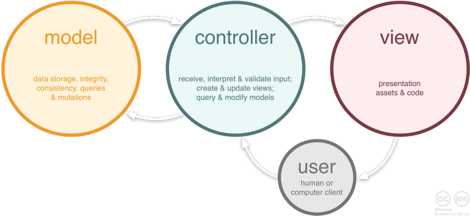
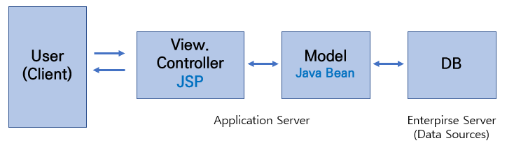
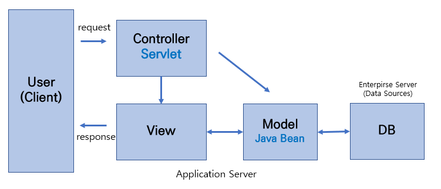
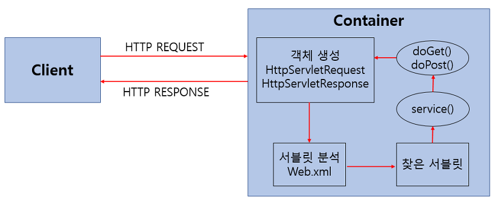
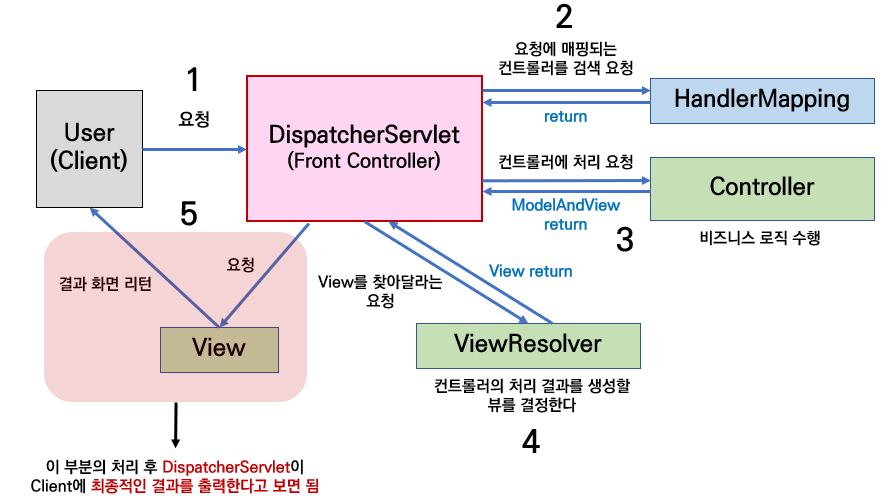

# 0116 What did I do today
- [ ] 기술 세미나 준비하기
  - [ ] 객체 지향 정리
  - [X] Spring MVC 구조 정리
  - [ ] DI 정리

## Spring의 MVC
### MVC란?

- **M**odel & **V**iew & **C**ontroller
- 애플리케이션을 개발할 때 사용하는 디자인 패턴
- UI 영역과 도메인 영역으로 구분되어 각자의 역할에 집중
  - 유지보수과 쉽고 확장성 및 유연성이 증가

#### Model
- 애플레이케이션의 데이터
- 클라이언트에게 응답으로 돌려주는 작업의 처리 결과 데이터
- Django의 Model

#### View
- 사용자 인터페이스 요소
- 화면에 보이는 리소스(Resource)를 제공하는 역할
- Django의 Template

#### Controller
- 데이터와 비즈니스 로직 사이의 상호동작 관리
- 클라이언트 측의 요청을 전달받아 비즈니스 로직을 거친 후 Model 데이터가 만들어지면 이를 View로 전달
- Django의 View

### MVC1 & MVC2
#### MVC1

- JSP가 View와 Controller 역할을 모두 담당
  - 가독성이 떨어지고 코드가 복잡하다.
- 분리하기로 했는데 합치면 어쩌누

#### MVC2

- MVC1의 단점을 보완한 패턴
- View와 Controller을 분리
- 기존의 JSP는 View의 역할만 하며 **Servlet**이 Controller 역할을 한다.
- Spring이 기반으로 하고 있는 패턴

> #### Servlet
> - 자바를 사용하여 웹 애플리케이션에서 클라이언트의 요청을 처리하고 응답을 생성하는 자바 클래스스
> - 클라이언트의 요청에 대해 동적으로 작동하는 웹 애플리케이션 컴포넌트
> 
> 

### Spring MVC 구조 및 동작

1. 클라이언트가 서버에 요청을 하면 Front Controller인 **DispatcherServlet 클래스**가 요청을 받는다.
    - **Dispatcher Servlet**
      - 가장 앞 단에서 클라이언트의 요청을 처리하는 Controller
      - 요청부터 응답까지 전반적인 처리 과정을 통제
      - Controller계의 옥천Hub 같은 느낌낌
2. DispatcherServlet은 프로젝트 내의 **@Controller** 인자를 통해 등록한 요청 위임 컨트롤러를 찾아 매핑(Mapping)된 컨트롤러가 존재하면 **@RequestMapping**을 통해 요청을 처리할 메소드로 이동
    - 클라이언트 요청을 처리할 적절한 컨트롤러를 찾는 과정에서 **HanlderMapping**이 쓰인다.
    - @RequestMapping을 통해 클래스 내부의 메서드가 각각 어떤 요청(GET, POST 등)에 대한 메서드인지 알 수 있다.
3. 컨트롤러는 요청의 처리를 담당하는 Service를 호출
    - **Service** 계층
      - Controller에 의해 호출되어 실제 비즈니스 로직과 트랜잭션을 처리
      - 우리가 일반적으로 생각하는 **올바른 요청을 처리한다**는 과정이 Service에서 일어난다고 생각하면 될 것 같다.
4. Service는 요청에 필요한 작업을 수행하고 해당 작업이 DB를 필요로 한다면 DAO에 요청하여 처리를 위임한다.
    - **DAO**
      - Data Access Object
      - DB의 데이터에 접근하기 위한 객체
      - 그러나 Spring에서는 이걸 **Repository**로 처리를 한다.
    - **Repository**
      - Service에 의해 호출되어 DB에서 데이터 처리를 해서 반환
  5. Service는 Repository에서 전달받은 데이터를 다시 컨트롤러에게 반환
  6. 컨트롤러는 해당 데이터를 받아서
      - Restful API를 따를 경우 클라이언트에게 JSON 형태로 응답을 반환
      - Spring에서 View 영역까지 관여를 할 경우 요청에 맞는 View 정보를 담아 DispatcherServlet에 전송
        - DispatcherServlet은 해당 정보를 **ViewResolver**에게 전달하고 ViewResolver는 해당 정보에 대한 JSP를 찾아 DispatcherServlet에 다시 전달
        - 그 후 DispatcherServlet이 클라이언트에게 뷰를 응답하며 요청이 정료
        - 근데 이런 과정은 우리가 신경쓰지 않아도 되는 부분이라 내일 세미나에서는 굳이...?

### 코드로 알아보기

## DI
- **D**ependency **I**njection
- 하나의 객체에 다른 객체의 의존성을 제공하는 기술
- 의존 관계에 있는 클래스들을 주입
  - **의존 관계** : 어떤 클래스가 다른 클래스를 참조하는 것
  - 객체를 직접 생성하는 것이 아니라 외부에서 생성 후 주입시켜 주는 방식
- Spring은 객체의 의존 관계를 DI를 통해 관리한다.
- 유연성을 확보하고 결합도를 낮춘다.

### Field Injection
- Bean으로 등록된 객체를 사용하고자 하는 클래스에 Field로 선언한 뒤 @Autowired 어노테이션 사용용
- 

### Setter Injection
- @Autowired 어노테이션을 사용해서 Setter 메서드를 통해 주입
- `final` 키워드를 사용할 수 없다.

### Construction Injection
- 클래스의 생성자를 통해서 의존성을 주입
- `final` 키워드를 사용할 수 있다.
- Lombok 라이브러리를 사용하면 코드가 간결해진다.

일단 의존성은..... 집 가서 마저 공부해보자 너무 어렵다....

# 0117 학습 세미나 준비 - 객체 지향 + MVC + DI
## 다루면 좋을 것 같은 내용
### 객체 지향
1. 객체 지향의 정의
2. 객체 지향과 절차 지향의 차이점
3. 객체 지향의 원칙 -> JAVA 코드를 예시로
4. 객체 지향의 의의
5. 자연스럽게 Spring에서 볼 수 있는 객체 지향 프로그래밍의 특징으로 넘어가기

결국 이 부분에서는 객체 지향 언어인 JAVA를 이해하기 위한 부분이고 이걸 통해서 스프링의 동작 구조도 원활하게 이해할 수 있는 것이니까 그걸 중점적으로 다뤄야할 것 같다.

지금까지 공부하면서 든 생각으로는 일단 자바는 모든게 클래스이다. 그래서 모든 동작은 클래스에서 클래스로 넘어간다.

### MVC
1. MVC 패턴의 정의
2. Spring에서 MVC 패턴의 구조 및 동작 순서
     - 근데 여기서 추가로 알아야 할 것들이 너무 많다.
       1.  DAO란?
       2.  DTO란?
       3.  서블렛은 뭐지?
       4.  JSP는 뭐지?

MVC가 복잡한 이유를 객체 지향 프로그래밍의 원칙과 관련지어서 설명하면 좋을 것 같다.