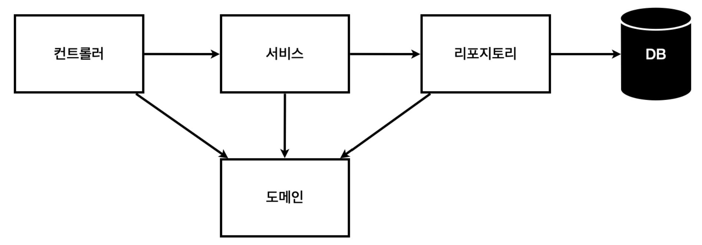
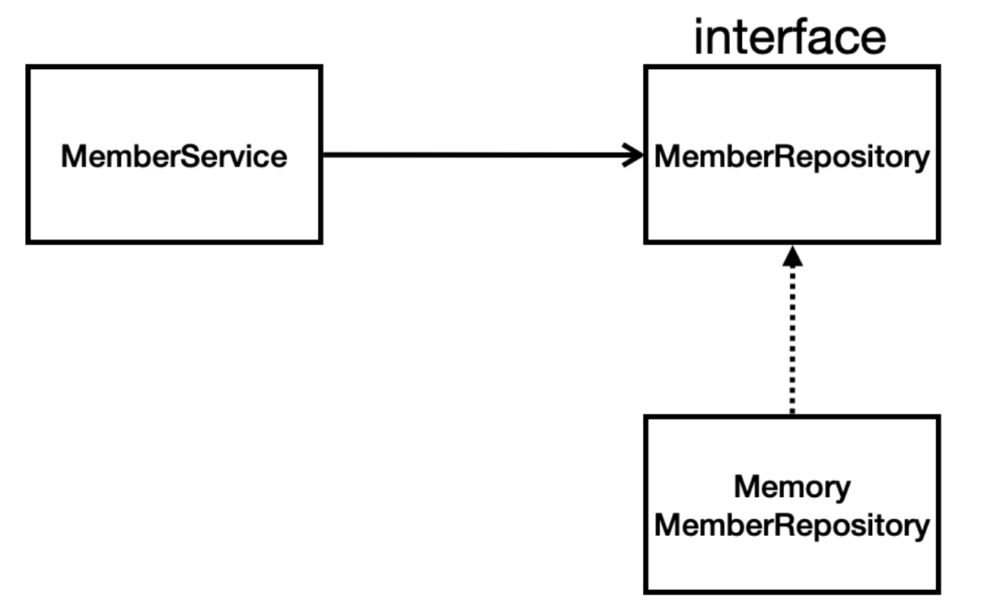

# 0118 What did I do today
- [ ] 스프링 입문 강의 다 듣기
- [ ] 피그마 공부
- [ ] Vue.js 공부
- [ ] Node.js 공부

## 김영한의 스프링 입문 - 코드로 배우는 스프링 부트, 웹 MVC, DB 접근 기술

### 스프링에서 정적 컨텐츠를 반환하는 방법
1. 웹 브라우저가 특정 url을 이용하여 요청한다. (ex. hello-static.html)
2. 스프링은 해당 url에 맞는 controller가 존재하는지 파악한다.
    - 그러나 정적 컨텐츠는 controller를 사용하는 것이 아니라 그냥 단순 html 파일이기 때문에 맞는 controller가 없다.
3. 맞는 controller가 없다면 스프링은 resources로 넘어가서 해당 요청에 맞는 html 파일이 있는지 확인한다.
4. 해당 html 파일을 반환한다.

이렇게 요청을 받고 응답을 보내주는 과정에서는 내장 톰캣 서버가 일을 하는데 그런 자세한 건 여기서 다루지 않는 것 같다.

### MVC를 활용하는 방법
1. 웹 브라우저가 특정 url로 요청을 보낸다.
2. 해당 url에 맞는 controller를 spring이 찾아서 데이터와 필요한 view에 대한 정보를 viewResolver로 전달한다.
3. viewResolver는 해당 정보를 이용해서 적절한 view 파일을 가져오고 이걸 웹 브라우저에 응답으로 보낸다.

이 부분은 사실 따로 공부를 했던 부분이라... 그냥 진짜 개략적으로만 여기에 작성했다.

### @ResoonseBody
- JAVA 객체를 HTTP 요청의 바디 내용으로 매핑하여 클라이언트로 전송
#### 사용 원리
1. HTTP의 Body에 문자 내용을 직접 반환
2. viewResolver 대신 HttpMessageConverter가 동작
3. 문자의 경우 StringHttpMessageConverter가, 객체의 경우 MappingJackson2HttpMessageConverter가 동작
4. 변환한 내용을 웹 브라우저로 응답

### 일반적인 웹 애플리케이션 계층 구조

1. 컨트롤러: 웹 MVC의 컨트롤러 역할
2. 서비스: 핵심 비즈니스 로직 구현
3. 리포지토리: DB에 접근, 도메인 객체를 DB에 저장하고 관리
4. 도메인: 비즈니스 도메인 객체, DB에 저장하고 관리될 애들



- 아직 DB가 선정되지 않았기 때문에 인터페이스를 이용해서 추상화만 해놓는다.
- 이 부분이 사실 조금 이해가 안 가는데 개발을 하면서 이해를 해야할 것 같다.

### 코드로 이해하는 도메인과 레포지토리
```java
// 회원 객체

package hello.hello_spring.domain;

public class Member {

    private Long id;
    private String name;
    // id나 name 같은 정보들은 보호받아야 하는 정보이기 때문에 외부에서 함부로 접근 못 하도록 private으로 관리

    public Long getId() {
        return id;
    }
    public void setId(Long id) {
        this.id = id;
    }

    public String getName() {
        return name;
    }
    public void setName(String name) {
        this.name = name;
    }
    // private에 접근하려면 getter 메서드와 setter 메서드를 사용해야 한다.
}
```
```java
// 회원 레포지토리 인터페이스

package hello.hello_spring.repository;

import hello.hello_spring.domain.Member;

import java.util.List;
import java.util.Optional;

public interface MemberRepository {
    Member save(Member member);
    Optional<Member> findById(Long id);
    Optional<Member> findByName(String name);
    List<Member> findAll();
    // 약간 DB를 필요로 하는 어떤 기능들을 만들건지 여기다가 대략적인 내용을 정의
}
```
```java
// 회원 레포지토리 메모리 구현체
// DB가 아직 확정되지 않았기 때문

package hello.hello_spring.repository;

import hello.hello_spring.domain.Member;

import java.util.*;

public class MemoryMemberRepository implements MemberRepository{

    private static Map<Long, Member> store = new HashMap<>();
    // store는 현재 DB가 지정이 되지 않았기 때문에 DB 역할을 하는 임시 저장소의 역할을 한다.
    // DB가 지정이 되면 이 자리는 DB가 차지를 하겠지.
    // Map은 파이썬의 딕셔너리와 같은 느낌으로 생각하면 된다.
    // 데이터를 키-값 쌍으로 저장하고 관리할 수 있는 구조
    // 여기서는 키: Long -> 각 Member 객체를 구분하기 위한 고유 식별자
    // 값: Member -> Member 객체 자체
    private static long sequence = 0L;
    // squence는 멤버의 고유 ID를 생성하기 위한 변수

    @Override
    public Member save(Member member) {
        member.setId(++sequence);
        // sequence의 값을 하나씩 증가시키면서 member.setId의 인자로 넘겨준다.
        // 이렇게 함으로써 저장된 멤버마다 고유한 ID가 보장된다.
        // pk같은 느낌인거지
        store.put(member.getId(), member);
        return member;
    }

    @Override
    public Optional<Member> findById(Long id) {
        return Optional.ofNullable(store.get(id));
        // Optional로 감싸면 null 값이 반환되었을 때도 적절한 동작을 할 수 있게 한다.
    }

    @Override
    public List<Member> findAll() {
        return new ArrayList<>(store.values());
    }

    @Override
    public Optional<Member> findByName(String name) {
        return store.values().stream().filter(member -> member.getName().equals(name)).findAny();
    }

    public void clearStore() {
        store.clear();
    }
}
```

### JUnit으로 테스트하기
- 스프링에서는 단위 테스트를 할 수 있다.
- Django에서도 가능하긴 했는데(unittest) 내가 써 본 적이 없는 듯.
  - Django 까먹을 것 같으니까 다시 공부하자... 토이 플젝 한 번 해보자.

```java
// src/test/java

package hello.hello_spring.repository;

import hello.hello_spring.domain.Member;
import org.junit.jupiter.api.AfterEach;
import org.junit.jupiter.api.Test;

import java.util.List;
import java.util.Optional;

import static org.assertj.core.api.Assertions.*;

class MemoryMemberRepositoryTest {
    MemoryMemberRepository repository = new MemoryMemberRepository();

    @AfterEach
    // 밑의 test 메서드가 끝날 때마다 이 동작을 수행
    public void afterEach() {
        repository.clearStore();
    }
    // test는 서로 의존 관계가 없어야 하므로 하나의 test가 끝날 때마다 repository를 초기화 시켜주는 동작이 필요
    // 이전 테스트 결과가 이후 테스트 결과에 영향을 미치지 않도록!

    @Test
    public void save() {
        // given
        Member member = new Member();
        member.setName("Spring");

        // when
        repository.save(member);

        // then
        Member result = repository.findById(member.getId()).get();
        assertThat(result).isEqualTo(member);
    }

    @Test
    public void findByName() {
        // given
        Member member1 = new Member();
        member1.setName("spring1");
        repository.save(member1);

        Member member2 = new Member();
        member2.setName("spring2");
        repository.save(member2);

        // when
        Member result = repository.findByName("spring1").get();

        // then
        assertThat(result).isEqualTo(member1);
    }

    @Test
    public void findAll() {
        // given
        Member member1 = new Member();
        member1.setName("spring1");
        repository.save(member1);

        Member member2 = new Member();
        member2.setName("spring2");
        repository.save(member2);

        // when
        List<Member> result = repository.findAll();

        // then
        assertThat(result.size()).isEqualTo(2);
    }
}
```
- 테스트는 **given**, **when**, **then** 의 세 부분으로 나누어서 작성하는 것이 좋다.
  - **given** : 이 테스트를 위해 어떤 정보가 주어졌는지
  - **when** : 이 테스트에서 무슨 일이 일어나는지
  - **then** : 그 결과로 어떤 것이 나와야 하는지

### 스프링 빈에 클래스 등록하기
- 컴포넌트 스캔과 자동 의존관계 설정
- 직접 스프링 빈 등록하기

#### 컴포넌트 스캔과 자동 의존관계 설정
- 스프링은 **@Component** 어노테이션이 있으면 해당 클래스를 자동으로 스프링 빈에 등록한다.
- **@Controller**, **@Service**, **@Repository** 도 @Component 어노테이션을 포함한 어노테이션이기 때문에 이들이 있어도 스프링 빈에 자동으로 등록이 된다.
  - 따라서 각각에 맞는 계층에 따라서 해당 어노테이션을 적어주면 된다.

> 스프링은 스프링 컨테이너에 스프링 빈을 등록할 때, 기본으로 싱글톤으로 등록한다. 싱글톤이 뭐냐면 하나의 클래스에 대해 단 하나의 인스턴스만 생성하도록 설계하는 디자인 패턴이다. 이거 정처기 때 했는데 참...
>
> 따라서 같은 스프링 빈이면 모두 같은 인스턴스다. 같은 타입의 스프링 빈을 여러 번 요청해도 항상 같은 인스턴스를 반환한다는 것이다.

#### 직접 스프링 빈 등록하기
```java
package hello.hello_spring;

import hello.hello_spring.repository.MemberRepository;
import hello.hello_spring.repository.MemoryMemberRepository;
import hello.hello_spring.service.MemberService;
import org.springframework.context.annotation.Bean;
import org.springframework.context.annotation.Configuration;

@Configuration
public class SpringConfig {

    @Bean
    public MemberService memberService() {
        return new MemberService(memberRepository());
    }

    @Bean
    public MemberRepository memberRepository() {
        return new MemoryMemberRepository();
    }
}
```
- Controller, Service, Repository와 동등한 위치에 `SpringConfig`라는 클래스를 만들어준다.
- 클래스 전체에는 **@Configuration**이라는 어노테이션을 달아준다.
- 내가 스프링 비능로 등록하고 싶은 클래스에 대한 메서드 앞에 **@Bean**이라는 어노테이션을 달아주면 스프링은 해당 클래스를 스프링 빈에 등록한다.

> 실무에서는 컴포넌트 스캔을 사용한다.
> 정형화 되지 않거나 상황에 따라 구현 클래스를 변경해야 하는 상황의 경우 직접 설정을 통해 스프링 빈으로 등록한다.